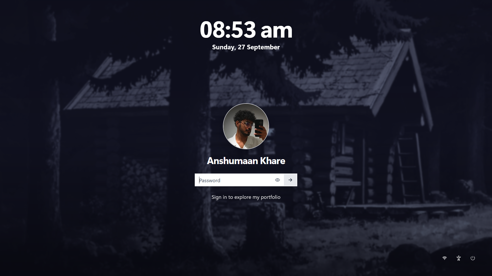
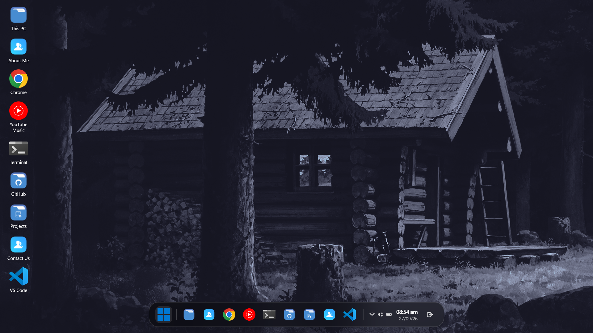
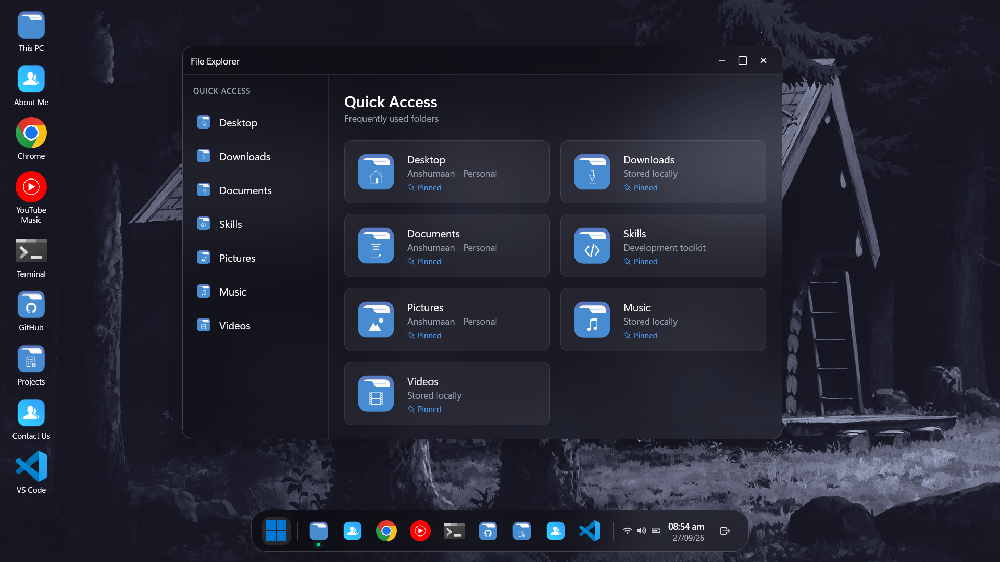
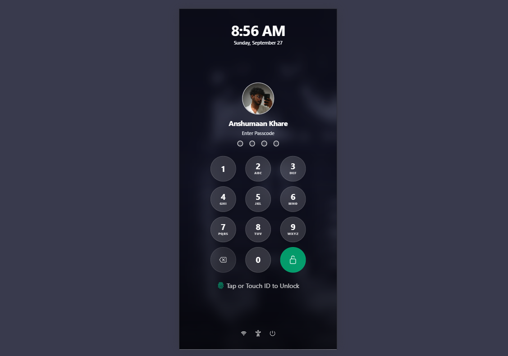
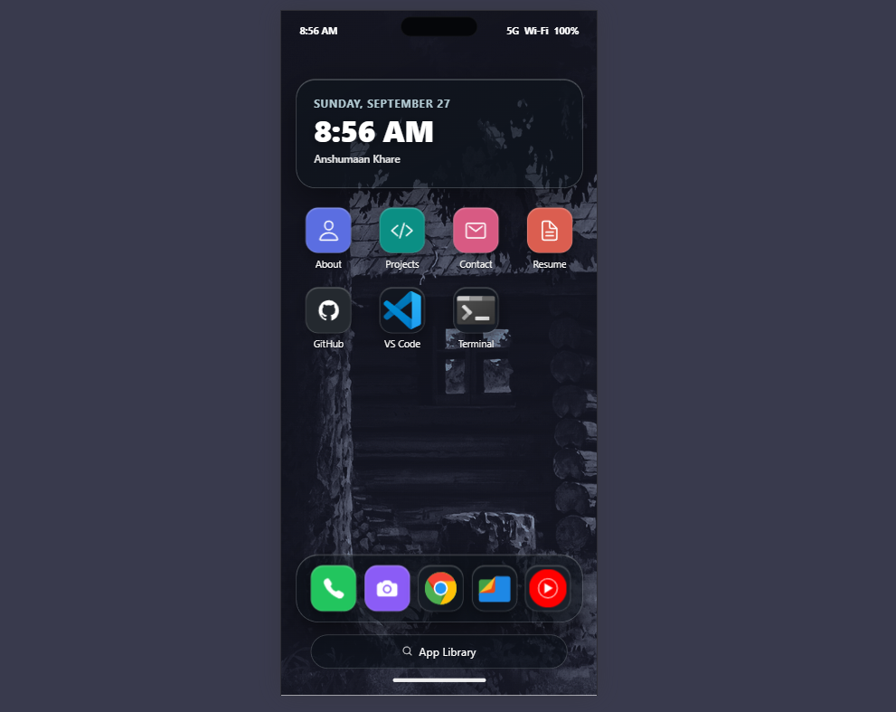
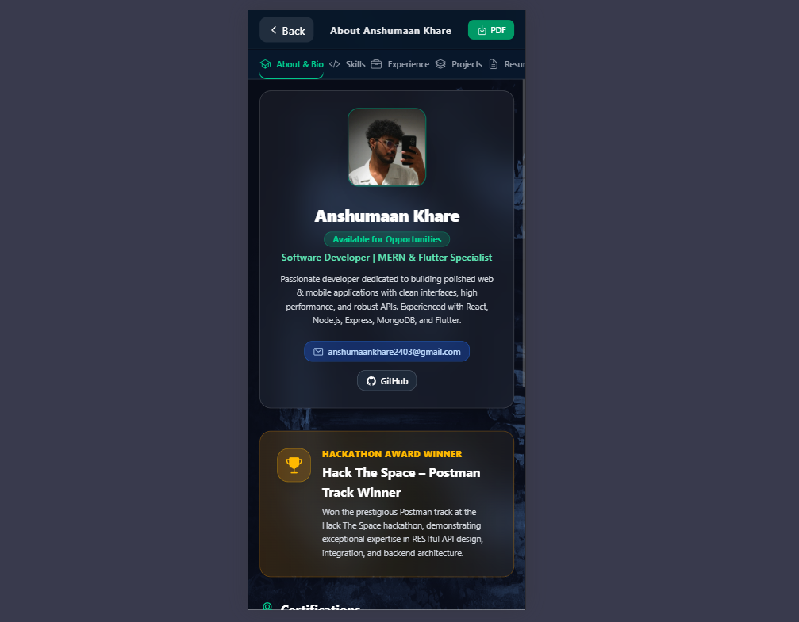

# Anshumaan Khare Portfolio

An interactive portfolio website designed as a desktop operating-system experience. It is built with React, Vite, Tailwind CSS, and reusable application-style windows.

## Live Demo

[View the live portfolio](https://portfolio-anshumaan-khare.vercel.app/)

## Screenshots

### Desktop Experience

<p align="center">
  
  
  
</p>

### Mobile Experience

<p align="center">
  
  
  
</p>

## Features

- Desktop login and logout flow
- Draggable portfolio application windows
- File Explorer, About, Projects, Contact, Terminal, VS Code, Chrome, Camera, and YouTube Music experiences
- Application menu and dock shortcuts
- Resume, skills, projects, and contact information
- Dedicated mobile layout

## Tech Stack

- React 19
- Vite 8
- Tailwind CSS 4
- Framer Motion
- React RND and React Draggable
- Monaco Editor
- xterm.js
- Three.js

## Requirements

- Node.js 20 or later
- npm

## Run Locally

1. Clone the repository and open the project folder.

   ```bash
   git clone <repository-url>
   cd Portfolio_Anshumaan_Khare
   ```

2. Install dependencies.

   ```bash
   npm install
   ```

3. Start the development server.

   ```bash
   npm run dev
   ```

4. Open the URL shown in the terminal, typically `http://localhost:5173`.

## Available Commands

| Command | Description |
| --- | --- |
| `npm run dev` | Start the Vite development server. |
| `npm run build` | Create an optimized production build in `dist/`. |
| `npm run preview` | Preview the production build locally. |
| `npm run lint` | Run ESLint checks. |

## Project Structure

```text
Portfolio_Anshumaan_Khare/
|- public/                         # Static files served directly
|  |- 1.png
|  |- 2.png
|  |- favicon.svg
|  |- icons.svg
|  `- screenshots/                 # Portfolio interface screenshots
|- src/
|  |- assets/                      # Images, SVGs, icons, and resume assets
|  |  |- wallpaper/                # Desktop wallpaper
|  |  |- resume/                   # Resume PDF
|  |  |- scalable/                 # Application SVG icons
|  |  |- color-lightblue/          # File Explorer icons
|  |  `- AndroideICONES/           # Additional app icons
|  |- components/                  # Desktop applications and UI components
|  |  |- About.jsx
|  |  |- AppMenu.jsx
|  |  |- App_icons.jsx
|  |  |- CameraApp.jsx
|  |  |- Chrome.jsx
|  |  |- ContactApp.jsx
|  |  |- Dock.jsx
|  |  |- FileExp.jsx
|  |  |- GitHubWindow.jsx
|  |  |- ProjectsApp.jsx
|  |  |- SplashScreen.jsx
|  |  |- Terminal.jsx
|  |  |- ThreeModel.jsx
|  |  |- VSCodeWindow.jsx
|  |  `- YtMusice.jsx
|  |- Pages/
|  |  |- HomePage.jsx              # Desktop layout and window management
|  |  `- HomepageForMobile.jsx     # Mobile layout
|  |- App.jsx                      # Root application component
|  |- index.css                    # Global styles
|  `- main.jsx                     # React entry point
|- .gitignore
|- eslint.config.js
|- index.html
|- package.json
|- vite.config.js
`- README.md
```

## Production Build

Create a production-ready build with:

```bash
npm run build
```

The generated static files are saved in `dist/`. To test that build on your computer, run:

```bash
npm run preview
```

## Developer

Anshumaan Khare
